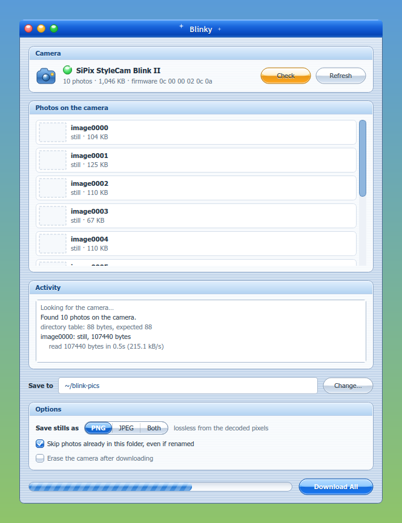

# blinky

[](https://github.com/AntAir267/blinky/actions/workflows/tests.yml)

A standalone Python + pyusb tool for the **SiPix StyleCam Blink II** (USB `0c77:1011`).
It speaks the camera's vendor protocol directly, reproducing what libgphoto2's
`camlibs/sipix/blink2.c` does, with retries, raw-data preservation, PNG output
and a built-in troubleshooter.

## Install

### As a package (recommended)

```bash
./packaging/build-deb.sh
sudo apt install ./packaging/blinky_1.0-1_all.deb
```

This installs `blinky` to `/usr/bin`, pulls in `python3-usb` and `python3-pil`,
and — the part that matters — drops a udev rule at
`/usr/lib/udev/rules.d/70-blinky-sipix.rules` and retriggers udev, so the camera
is usable without root from the moment it is plugged in. It also installs a man
page, bash completion and a desktop entry with actions for downloading,
listing and diagnosing.

Package-provided udev rules belong under `/usr/lib`; `/etc/udev/rules.d/` is
reserved for local overrides, so a hand-written rule there keeps working and
continues to take precedence.

Uninstall with `sudo apt remove blinky`.

### From the source tree

pyusb lives in a project venv (`.venv`) that also sees the system Pillow.
The `blinky` wrapper picks it up automatically:

```bash
./blinky doctor
```

To recreate that venv from scratch:

```bash
python3 -m venv --system-site-packages .venv && .venv/bin/pip install pyusb
```

(`sudo apt install python3-usb` works too, if you would rather not have a venv.)

Running from the source tree, device access needs a udev rule (the package
installs one for you):

```
SUBSYSTEM=="usb", ATTR{idVendor}=="0c77", ATTR{idProduct}=="1011", TAG+="uaccess"
```

## The window



`blinky-gui` does the same things without the terminal: finds the camera, lists
what is on it, downloads with a progress bar, and runs the five checks. Photos
already in the output folder appear as thumbnails. Raw camera bytes reach the
disk before anything decodes them, exactly as on the command line, and all
camera work happens on a worker thread so the window never blocks.

The look is a deliberate hybrid of the two desktops of 2001. Windows XP's Luna
supplies the blue gradient title bar, the Tahoma typography and the Control
Panel group boxes; Mac OS X's Aqua supplies the pinstripe background, the
traffic lights, the gel buttons and the barber-pole progress bar. Every part is
painted rather than themed, so it looks the same on any desktop.

It needs PyQt6 (`python3-pyqt6`). The command line tool does not, and the
package only recommends it.

## Commands

| Command | What it does |
| --- | --- |
| `blinky doctor` | Five link checks, in order, stopping at the first failure |
| `blinky list` | Firmware ID, photo count, and the directory table |
| `blinky download` | Fetch photos to `~/blink-pics`: raw bytes first, then decode |
| `blinky decode RAW...` | Decode already-saved `.raw` files to PNG (no camera needed) |
| `blinky delete` | Erase photos from the camera |
| `blinky convert [PATH...]` | Batch-convert `.pnm` files to PNG (no camera needed) |
| `blinky-gui` | The window shown above |

Useful options: `--images 0,2-4`, `--out DIR`, `--force`, `--format both`,
`--delete-after`, `--retries N`, `--timeout MS`, `-v`, and `--report [FILE]`
on any command.

### Output layout

Stills are saved **twice**: `imageNNNN.raw` is the exact byte stream from the
camera, written and fsynced *before* anything tries to interpret it, and
`imageNNNN.png` is the decoded picture. If a decode ever goes wrong, the raw
data is still on disk and `blinky decode` can retry it without another transfer
over a flaky link.

Video clips need no decoding, so `imageNNNN.avi` **is** the untouched raw data;
there is no separate `.raw` for a clip.

### Deleting

The protocol has exactly two delete commands and neither is per-image:
request `0x12` erases **everything**, and `0x11` erases only the newest image.
libgphoto2 implements only the first. So `blinky delete` can erase everything,
or pop the newest *N* off one at a time with `--last N`, and nothing else.

It always confirms first, and refuses outright if there is no terminal to
confirm at, unless you pass `--yes`.

`blinky download --delete-after` erases the camera once the download is done,
but only when that is provably safe. Because the camera can only erase
everything, it refuses if anything failed, if `--images` selected only some
photos (erasing would destroy the rest), or if any file fails to re-read from
disk and match byte for byte what was transferred. Photos skipped because an
identical copy was already in the folder count as accounted for.

### Duplicate detection

By default a photo already in the output folder is recognised **by content**
and not transferred again. The `.raw` and `.avi` files blinky writes are the
camera's exact bytes, so the first 4 KB of a local file hashes to the same
value as the camera's own — and `GET_MEMORY` honours a short length, so reading
that prefix costs about 30 ms instead of the seconds a whole image takes.

This means a photo is recognised after being renamed or moved, and a *different*
photo that merely reuses a filename is not mistaken for it — it gets saved
alongside under a free name rather than clobbering anything. `--no-skip-duplicates`
falls back to matching filenames only.

### Picture formats

`--format png` (the default), `jpeg`, or `both`, with `--jpeg-quality`.

Worth knowing before choosing: **the camera's own data is already JPEG**, so
`png` is lossless from the decoded pixels while `jpeg` puts the image through a
second lossy pass. The `.raw` file kept alongside is the camera's original JPEG
bitstream and opens in any viewer as the 640x240 interleaved frame.

### `convert`

Converts `.pnm` files (such as ones gphoto2 already produced) to PNG. It reads
the PNG back and compares it pixel for pixel against the source before calling
it done, never overwrites an existing file, and keeps the originals unless you
pass `--delete-originals` — which only ever deletes a source whose PNG verified.

### `doctor`

1. Camera is on the USB bus. On failure, scans `journalctl -k` for `-71`,
   "disabled by hub (EMI?)", descriptor read failures and "not accepting
   address", and explains that those are cable/port/power faults, not software.
2. Device opens without root. On failure, checks for the udev rule and prints
   either the rule to create or the `udevadm` reload to run.
3. No other process has the device open. On failure, names the process (pid and
   command) and gives the matching fix — `gio mount -u gphoto2://` for GVFS.
4. Handshake: firmware ID reads 6 bytes, photo count reads 2.
5. Directory table is `8*(numpics+1)` bytes and every entry's end is at or
   after its start.

`--report FILE` writes the check results, the relevant kernel log lines,
`lsusb -v -d 0c77:1011` and the tool's own log into one shareable text file.
If the kernel log is not readable it says so and carries on.

## Protocol

From `camlibs/sipix/blink2.c` and `blink2.txt`. Everything is vendor control
transfers on endpoint 0 plus one bulk IN endpoint (config 1, interface 0,
altsetting 0).

- Control read: `bmRequestType 0xC0`, control write: `0x40`. `wValue` is `0x03`
  for every request this tool uses, `wIndex` is 0.

| Request | Direction | Meaning |
| --- | --- | --- |
| `0x18` | read 6 | Firmware ID |
| `0x04` | read 1 | Initialise still mode |
| `0x08` | read 2 | Photo count, big-endian |
| `0x0d` | read 1 | Arm the directory dump, then bulk read |
| `0x0a` | write 8 | Request memory: `start` BE32 then `len` BE32, then bulk read |

**Directory table.** `numpics + 1` slots of 8 bytes, read off the bulk endpoint
after request `0x0d`. The slots are staggered: for image `i`, the start is a
3-byte big-endian value at `buf[8*i+5..7]` (slot `i`) and the end is at
`buf[8*i+13..15]` (slot `i+1`). Each slot's start doubles as the previous
image's end, which is why there is one extra slot. The movie flag is
`buf[8*(i+1)]`: nonzero means AVI.

`blink2.c` asks for the size rounded up to a multiple of 64, but this camera
answers with exactly `8*(numpics+1)` bytes and ends the transfer with a short
packet. That is what the local libgphoto2 patch accounts for, and this tool
does the same: it requests the rounded size and accepts the short answer.

**Image fetch.** `len = (end - start) / 4`. Control-write `0x0a` with `start`
and `len` as big-endian 32-bit values, then bulk read **`len * 8`** bytes —
twice the address span. For a still, that payload is a plain JPEG.

**Decode.** The camera's JPEG is **640x240**; the finished image is **640x480**.
Each JPEG scanline carries two 320-pixel fields interleaved in 16-pixel blocks
with an 8-pixel phase offset, and each field is pixel-doubled horizontally back
to 640:

- field A: `A[16m+k] = src[32m+8+k]`
- field B: `B[0..7] = src[0..7]`, `B[16m+8+k] = src[32m+24+k]`, `B[312..319] = src[632..639]`

Each scanline emits two output rows, A then B, so the height doubles.
`blinky` writes the PNG straight from these pixels; no PNM is involved.

Both halves of that model were checked against real camera output: in the PNMs
gphoto2 produced, every horizontal pixel pair is identical (confirming the
doubling), and inverting the field mapping to rebuild a source scanline and
re-running the decoder reproduces all 921600 raster bytes exactly.

It was then checked end to end against the patched libgphoto2 on the same
camera: for images 0, 4 and 8, `blinky`'s PNG raster is byte-identical to the
`.pnm` that `gphoto2 --get-file` writes, all 921600 bytes.

Where the two differ is damaged data. If a photo's entropy stream is corrupt in
the camera's own memory, gphoto2 writes no file at all; `blinky` decodes the
rows that are readable, marks the result partial, and keeps the raw bytes. On
this camera `image0005` is such a photo — three independent transfers return
byte-identical data, so the damage is on the device, not on the wire.

## Reliability notes

This camera's USB link is fragile; `-71` (EPROTO) errors and
`disabled by hub (EMI?)` in `journalctl -k` mean the cable, port or hub dropped
the connection. `blinky` is built around that:

- Raw bytes are fsynced to disk before any decoding.
- Each image is retried as a whole, re-issuing the `0x0a` request, with
  exponential backoff; the bulk endpoint is drained between attempts so a
  half-finished transfer cannot desynchronise the next one.
- Short reads, timeouts and retries are logged individually.
- When a transfer fails, the kernel log for the run's time window is pulled in
  automatically and any USB link errors are explained inline.
- A USB stall (`EPIPE`) is reported as what it is. The camera's firmware can
  wedge while still sitting on the bus, answering every vendor request with a
  stall. Clearing the halt, re-setting the configuration and resetting the
  device were all tried against real hardware in that state and none of them
  revive it, so blinky says so and tells you to remove power instead of
  offering a fix that does not work.

When `doctor` blames the link, its advice is built from this machine rather
than from generic suggestions: it surveys sysfs for ports that are actually
free, skips SuperSpeed root hubs (a 12 Mbps full-speed camera cannot attach to
one), flags external self-powered hubs, deprioritises the bus the failure
happened on, and prints the two runtime kernel knobs worth trying —
`usbcore.old_scheme_first=1`, which makes the kernel assign an address before
reading the device descriptor the way pre-USB-2.0 devices expect, and a
`DELAY_INIT`/`DELAY_CTRL_MSG` quirk for the camera's VID:PID.

## Tests

`tests/` drives a simulated camera (`tests/simcam.py`) so the protocol, retry,
decode, download, convert and `doctor` paths can all be exercised with nothing
plugged in:

```bash
.venv/bin/python tests/test_blinky.py
```

The decoder tests run against a real `.pnm` in `~/blink-pics` when one is
present, checking both that every horizontal pixel pair is identical and that
inverting the field mapping and re-decoding reproduces the raster exactly.
